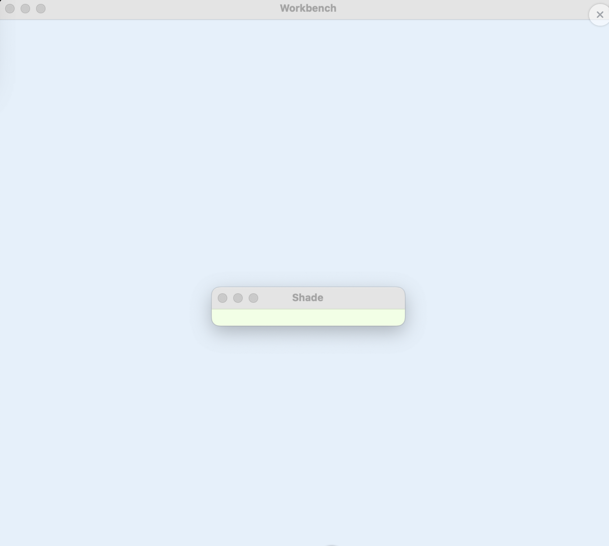
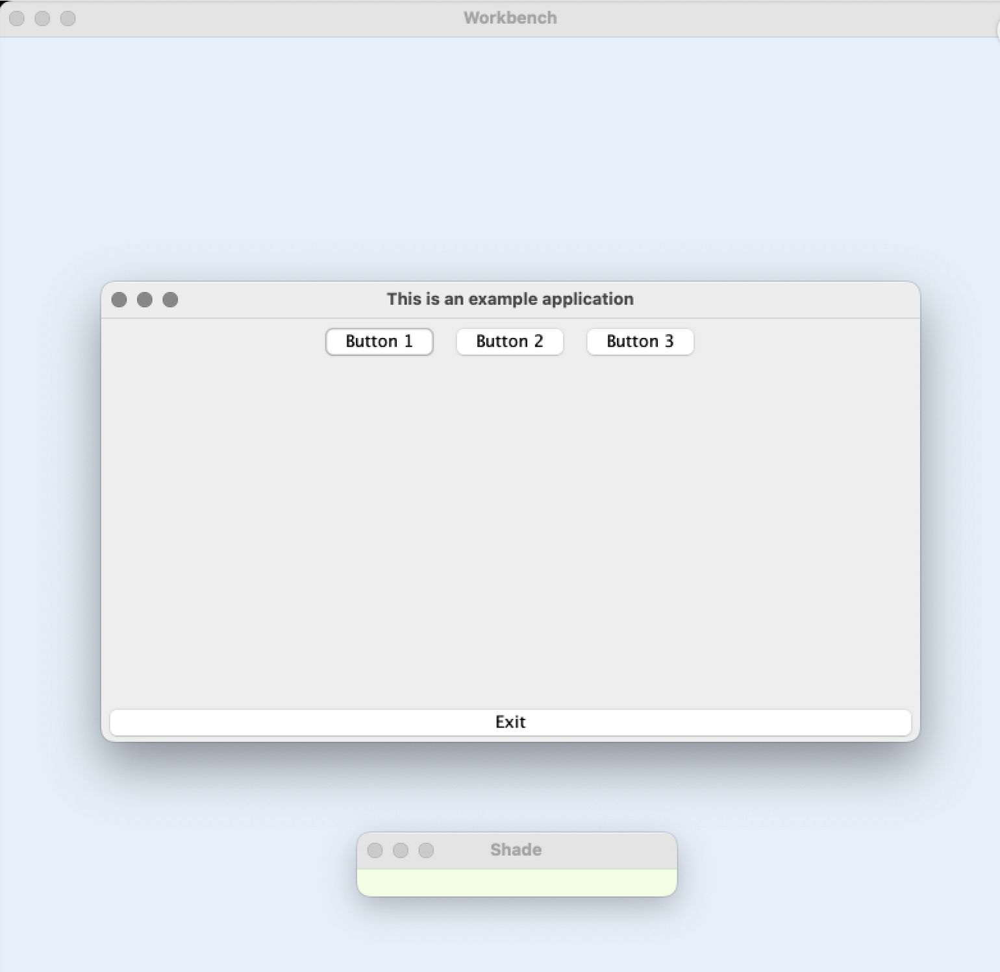
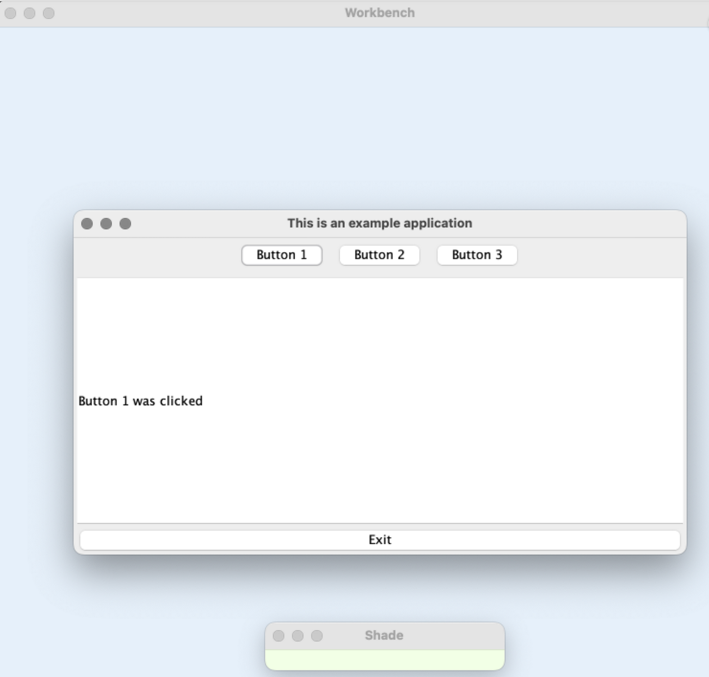
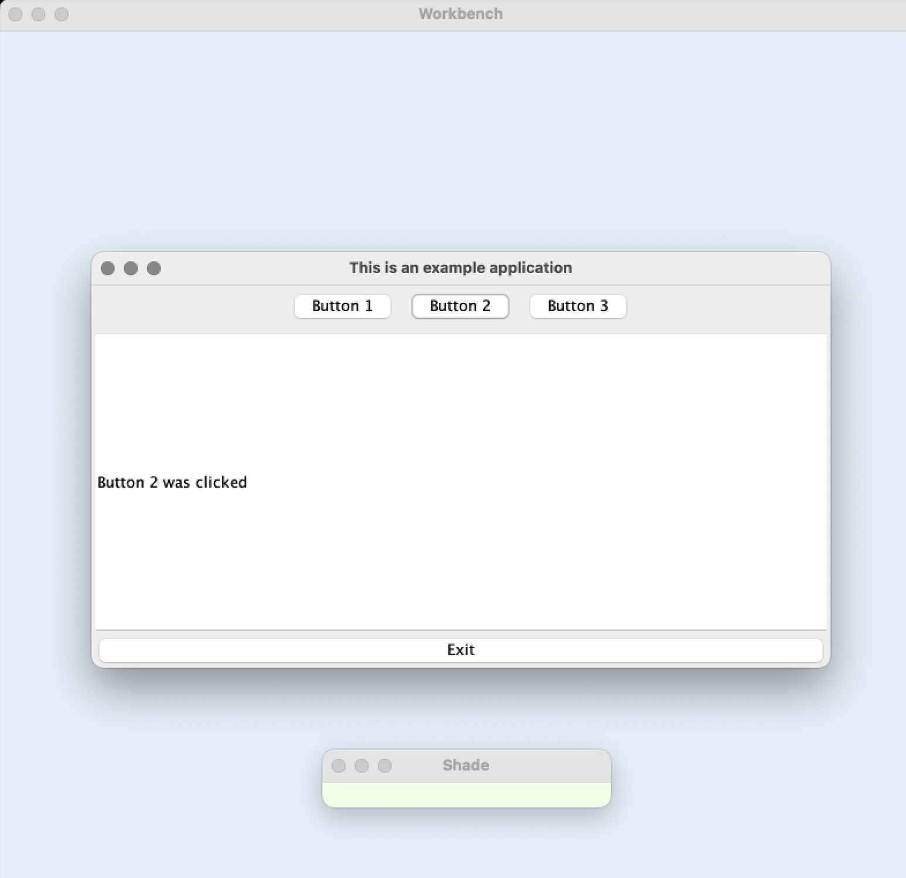

# Arctic Readme

**Arctic**, an open-source multi platform tool developed by the Corretto Team to automate interactive UI tests. **Arctic** supports existing tests and is agnostic to how those tests are written.


## What are Arctic’s capabilities?

**Arctic** can be used to validate any type of UI test, as it does not require any special support from the application side. **Arctic** relies on the operating system to capture all the required events during recording time and then reproduce them during replay time. This allows **Arctic** to operate with older tests that were not written with automation in mind without the need to modify them.

**Arctic** runs on **Linux, macOS (aarch64 and x86_64), and Windows (x86_64)**.

## How do I start using Arctic?

### Arctic Configuration

**Arctic** is a Java application, so it requires a JDK. **Arctic** needs at least OpenJDK 11 to run, but we recommend using **OpenJDK 17** or **OpenJDK 21**.

**Arctic** can be configured using the **recorder.properties** and **player.properties** files, which are read from the current working directory. If one or both are not present, sample versions will be written. These files include information what each property key does.

### Test environment configuration

As **Arctic** relies on pixel comparison to validate the different results, changes to the testing environment may cause **Arctic**to report false positives. Some of the common settings that can cause problems are

- Desktop background
- Screen resolution
- UI theme
- Installed fonts
- Color profile

**NOTE:** **The demo** app you will see in the following section was prepared on macOS.

- Download Arctic JARs 
- Download Arctic [Arctic](https://github.com/corretto/arctic)

### Arctic control keys

Because **Arctic** captures all keyboard and mouse events, during the recording we need a way to tell **Arctic**what we want it to do without interfering with the test. This can be done by pressing specific key combination. When several modifier keys are pressed (such as **ctrl** or **alt**) **Arctic** will interpret the next key presses as instructions. Among others, these instructions can be to start or stop the recording or to capture a screenshot.

The keys are configured in the **recorder.properties** file with properties that start with **arctic.recorder.control.jnh**. The correspondence between keycodes and keys can be checked by running ```java -jar Arctic.jar -k```. This command will print the keycode of the different keys as they are pressed. By default, **ctrl+alt+z** is used to start/stop the recording and **ctrl+alt+x** is used to capture a screenshot.

### Record a test

Before running a test, start **Arctic**in recording mode by executing ```java -jar Arctic.jar -r```.



Once you see the *Workbench* and *Shade windows*, you can start running a test case. Before starting the recording, make sure the *Workbench* window covers the entirety of the screen that will be relevant during test execution. *The shade window* can be used to hide parts of the screen that should be avoided during image comparison.

Additionally, we need to tell **Arctic** which test is on the screen. Arctic identifies tests with two strings, the **testName** and the **testCase**. We can do this by writing test run **<testName> <testCase>** in the arctic command line.

**Arctic** can also receive this information via RMI. This requires setting the configuration key **arctic.common.cmd.rmi.enabled** from **false** to either **local_only** or **true**. Once this is done, we can send this information through a second arctic instance, running ```java -jar Arctic.jar -c test run <testName> <testCase>``` or by implementing a custom application that uses the RMI interface present in **ArcticShared.jar**



Next, we start the recording and manually interact with it.



Every time a user interaction causes a change to the UI that we consider relevant, we take a screenshot. In this case, we want the screen to capture the change that says **"Button 1 was clicked"**



After working with our UI test, there is now a new change in the UI. We want to capture a second screenshot to ensure that the **"Button 1 was clicked""** message has now changed to **"Button 2 was clicked"**.

Once we are done with the test and close the window, we can stop the recording. Capturing the act of closing the test as part of the recording is optional, but will leave the environment ready for the next one.

Screenshots and recordings will be saved in the **arctic_tests** folder. This can be configured in both **recorder.properties** and **player.properties**, but they need to match:

```# Defines where the test suite we record will be stored.```

```arctic.common.testPath = ../arctic_tests```

### Replay a test

Once the recording is finished, **Arctic** is ready to replay the test. Launch **Arctic** in player mode with ```java -jar Arctic.jar -p```.

Once **Arctic** has loaded, start the relevant test and then instruct **Arctic** to run it with ```java -jar Arctic.jar -c test run <testName> <testCase>```. **Arctic** will reproduce the keyboard and mouse events and capture screenshots at the same time as in the recording.

https://github.com/user-attachments/assets/ae7f6bd1-5c18-4bff-8e30-ce118c6150fb
Once the test is finished, we can pass this information to **Arctic** with ```java -jar Arctic.jar test finish <testName> <testCase> <result>```. We can use result to tell **Arctic** whether anything has gone wrong on the test side, for example, based on the return code of the test. If result is true and all screenshots captured during the test are considered good enough, **Arctic** will mark the test as OK. If any of the screenshots were different or the result is false, **Arctic** will mark the test as failed.

### Getting Arctic results

Once all the tests have run, we can export the results into one of the supported formats  **junit**, **tap**, or **jtx**. Such report files that will contain a list of the tests that **passed/failed** can be generated with ```java -jar Arctic.jar <format> save <filename>```. For example, generated jtx files for failed tests can later be used as exclude files for jtHarness.
Valid formats are:

- **xml**: junit xml report
- **tap**: TAP version 13
- **jtx**: jtHarness exclusion file

### Review screenshot comparisons

For multiple reasons, tests may not pass for the first time after recording. The results can be reviewed by using the **Arctic** command sc. For example, ```java -jar Arctic.jar -c sc all``` will start a review of all the screenshots that failed in the current session. This can help you identify why the recording failed, and also add the current screenshot as an alternative to be compared in future runs.

### Contribution Guidelines Instructions

- Fork this repository
- Clone your forked repository
- Add your scripts
- Commit and push
- Create a pull request